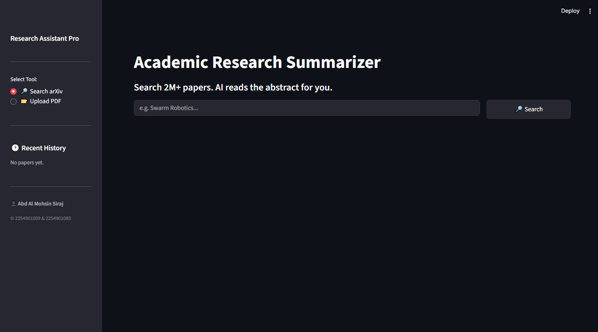
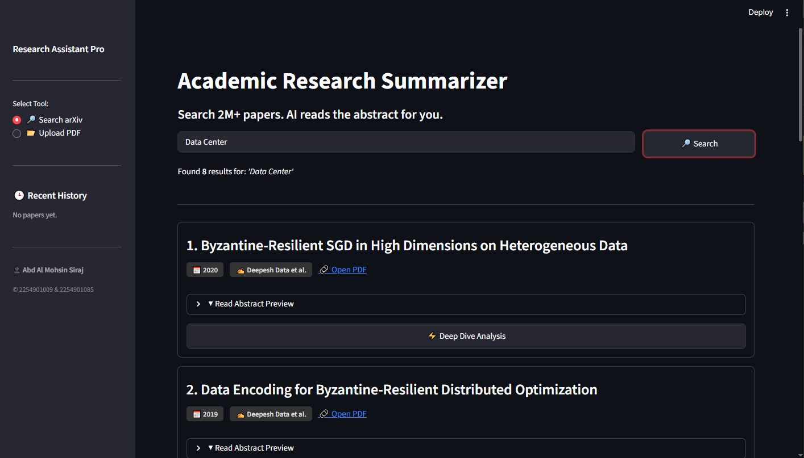
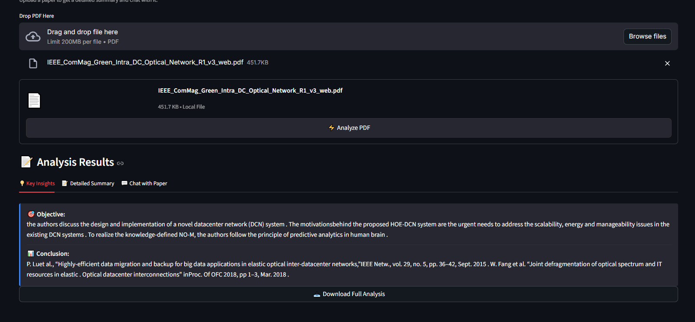
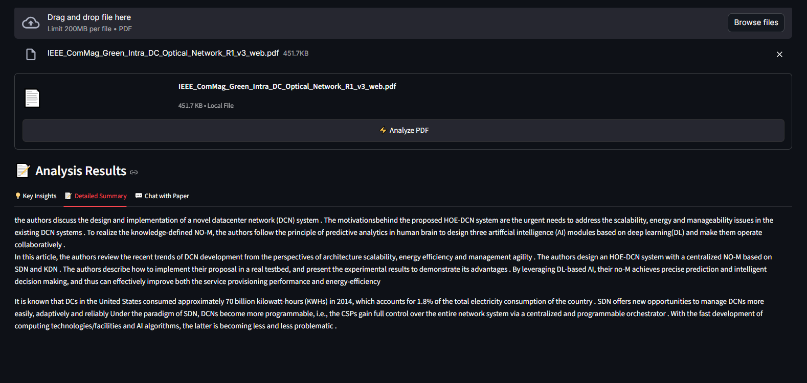
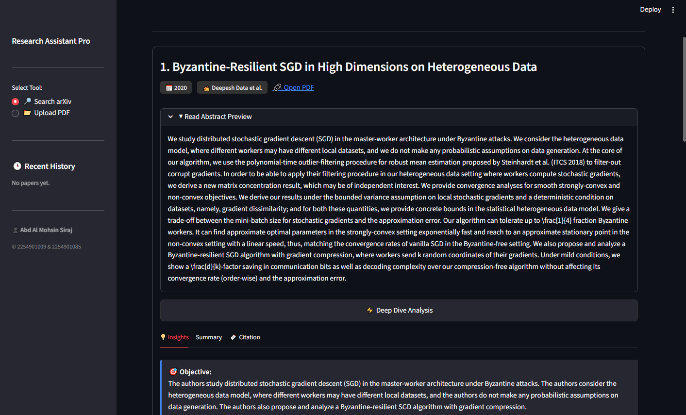
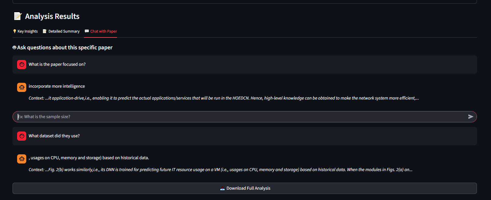
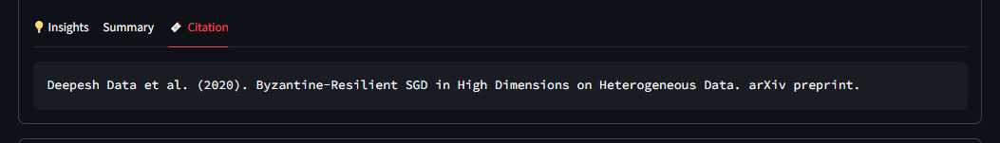
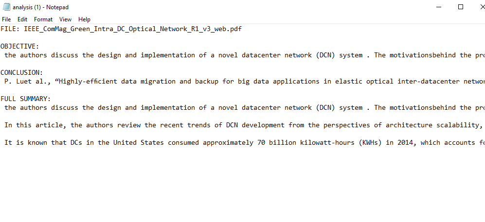
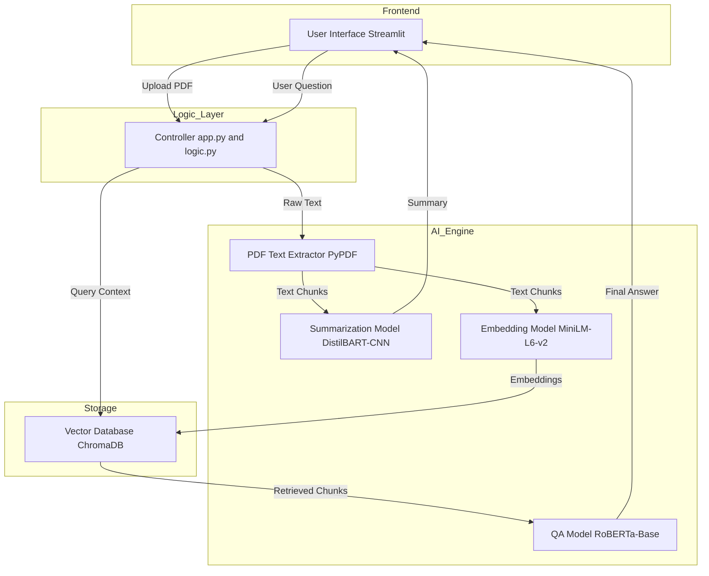

# Academic Research Paper Summarizer

**Presented by:** Abd Al Mohsin Siraj & Nishat Tasneem

## Overview

The AI Research Assistant is a specialized dashboard designed to accelerate academic discovery. It connects directly to the arXiv API to fetch real-time research papers and utilizes Natural Language Processing (NLP) to generate structured executive summaries, helping researchers filter through literature **70% faster**.

Unlike standard summarizers, this tool features a **RAG (Retrieval-Augmented Generation)** engine, allowing researchers to "chat" with PDF documents to extract specific data points like sample sizes, methodologies, and datasets.

## Application Gallery

### 1. Research & Discovery

#### Real-Time Search

- Search 2M+ papers via arXiv API
- Drag & drop local PDFs for analysis



### 2. Analysis & Insights

#### Key Insights Extraction


#### Detailed Summaries

- Auto-extracts Objectives & Conclusions
- Generates structured executive summaries


### 3. Interactive AI

#### Deep Dive Analysis


#### RAG Chat Bot

- Tabbed view for citations & insights
- Ask questions like "What is the sample size?"

#### Additional Features


- Direct citation generate
- txt file generated for notes

## System Architecture

The project utilizes an AI Engineering approach to run large language models locally on a CPU.




## Key Features

- **Real-Time Search:** Queries the arXiv database for up-to-date papers.
- **Smart Summarization:** Uses `sshleifer/distilbart-cnn-12-6` to condense abstracts into meaningful insights.
- **Deep Dive Analysis:** Automatically extracts Objectives and Conclusions separate from the main summary.
- **RAG-Powered Chat:** Implements LangChain and ChromaDB to enable context-aware Question & Answering on specific documents.
- **Auto-Citation:** Generates APA-style citations instantly.
- **Exportable Reports:** One-click download of research notes to `.txt`.

## Installation

To run this project locally:

### 1. Clone the Repository

```bash
git clone https://github.com/YourUsername/Research-paper-summarizer.git
cd Research-paper-summarizer
```

### 2. Create a Virtual Environment (Recommended)

```bash
python -m venv venv
# Windows:
.\venv\Scripts\activate
# Mac/Linux:
source venv/bin/activate
```

### 3. Install Dependencies

```bash
pip install -r requirements.txt
```


## Usage

Run the application using Streamlit:

```bash
streamlit run app.py
```

The application will launch in your default web browser at `http://localhost:8501`.

## Technical Challenges Solved

- **Context Window Management:** Implemented `RecursiveCharacterTextSplitter` with a chunk size of 500 tokens to prevent model hallucinations and fit within the RoBERTa context window.

- **PDF Noise Cleaning:** Developed a custom cleaning pipeline to strip IEEE headers, citations, and reference lists before processing to improve summary quality.

- **Vector Search:** Utilized ChromaDB for semantic search, allowing the chat bot to find answers even when exact keywords don't match.

## License

This project is open-source and available under the MIT License.